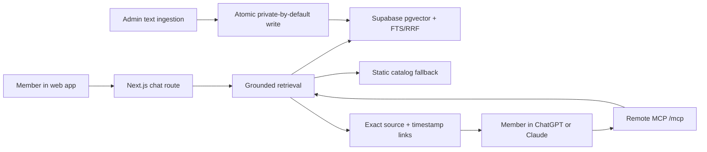

# Ask Samin

Ask Samin is a hostable, citation-first knowledge app for Samin Yasar's video library. Members start with their goal, stage, tools, and blocker, then get full-video recommendations grounded in transcript evidence with links to the exact matched caption cue.

The same retrieval layer is exposed as a remote MCP server at `/mcp`, so members can use it inside ChatGPT or Claude without handing this application their AI account credentials. The standalone site intentionally returns deterministic source discovery only; the signed-in MCP host owns model inference for the conversational experience.

## What is included

- Intake-first standalone source navigator with verified labels and server-built YouTube timestamp links.
- Searchable video and Shorts library with honest transcript-coverage states; Shorts are browse-only.
- ChatGPT- and Claude-compatible MCP tools for full-video search and exact matched-source lookup.
- Private-by-default admin ingestion preview for YouTube metadata, community calls, documents, and web resources.
- Supabase Postgres schema using pgvector, Postgres full-text search, HNSW, GIN, and reciprocal-rank fusion.
- Static MiniSearch fallback for local development and pre-database deployments.
- Public `/prompts` ledger sourced from the exact prompts the app runs.
- Resumable creator-export ingestion with a shared lock, manifest, bounded workers, and three-attempt failure ceiling.
- Loopy workflow in [`LOOPS.md`](./LOOPS.md).

## Architecture



See [`docs/ARCHITECTURE.md`](./docs/ARCHITECTURE.md) for the design and auth decision, and [`docs/INGESTION.md`](./docs/INGESTION.md) for the best place to add more videos, community calls, and documents.

## Recommendation boundary and token flow

The first recommendation turn is an intake gate: goal, current stage, tools, and blocker. Recommendation APIs then return only full videos backed by timed transcript cues. Shorts and metadata-only entries remain visible in Library browse but can never enter recommendation results.

The standalone site runs no model and consumes no model-inference tokens. When `/mcp` is connected, ChatGPT or Claude remains the host: it owns sign-in, model selection, and account usage. Ask Samin receives the tool query and returns read-only transcript evidence; it receives neither the member's password nor a personal API key.

## Run locally

Requirements: Node.js 20 or newer and Python 3.10 or newer for local transcript imports.

```bash
npm install
cp .env.example .env.local
npm run dev
```

Open [http://localhost:3000](http://localhost:3000). The app is useful without secrets: source search and the MCP retrieval endpoint run against the generated catalog.

Optional environment variables:

- `NEXT_PUBLIC_SUPABASE_URL` and `SUPABASE_SERVICE_ROLE_KEY`: enable persistent hybrid retrieval and ingestion.
- `ADMIN_INGEST_TOKEN`: protects the ingestion write route; use at least 32 random bytes.
- `NEXT_PUBLIC_APP_URL`: canonical deployment URL used in MCP connection instructions.

The application intentionally does not accept personal model-provider API keys and does not use an owner-funded model key on the public chat route.

## Add creator-owned transcripts

Put `.vtt`, `.srt`, `.json`, or `.txt` exports in `imports/`. The filename must contain the 11-character YouTube ID. Then run:

```bash
npm run ingest:exports
npm run catalog:build
npm run qa
```

Timed formats preserve exact cues as compact anchors inside each transcript chunk. Plain text becomes searchable but is labeled as untimed. The importer uses five workers by default, retries a failed file no more than three times, and records keep/discard evidence in `.cache/ingestion/manifest.json` under a file lock.

The current `/admin` form accepts metadata and pasted creator-owned text, previews normalization, and can atomically persist to Supabase when configured. New records are private unless publication is explicitly selected. File upload, Storage-backed parsing, embedding backfill, and an asynchronous publish worker are future production work; do not run bulk transcription in a Vercel request.

## Verify

```bash
npm run qa
npm run build
```

`npm run qa` runs linting, strict TypeScript, unit tests, and catalog integrity checks. The measurable retrieval QA plan is in [`docs/QA.md`](./docs/QA.md).

Release evidence is recorded in the [`channel audit`](./docs/CHANNEL-AUDIT.md) and [`Loopy release receipt`](./docs/RELEASE-RECEIPT.md).

## Deploy

The project is configured for Vercel. Link only the intended showcase project, add environment values there, and deploy:

```bash
npx vercel link
npx vercel deploy --prod
```

No billing, trial, or subscription setup is performed by the repository.

## Why there is no third-party “Login with ChatGPT” button

The referenced `opencoredev/login-with-chatgpt` project currently reuses Codex CLI's OAuth client identity and an undocumented ChatGPT backend. OpenAI's own Codex login warns users to cancel if a website gives them its device code. That is not an appropriate production trust boundary for member credentials.

This build preserves consumer-controlled model use safely: members connect the public `/mcp` retrieval server to ChatGPT or Claude, where the signed-in client owns authentication, inference, and account usage. The standalone site is retrieval-only. The evidence and exact decision are recorded in [`docs/AUTH-DECISION.md`](./docs/AUTH-DECISION.md).
